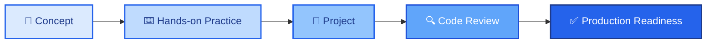
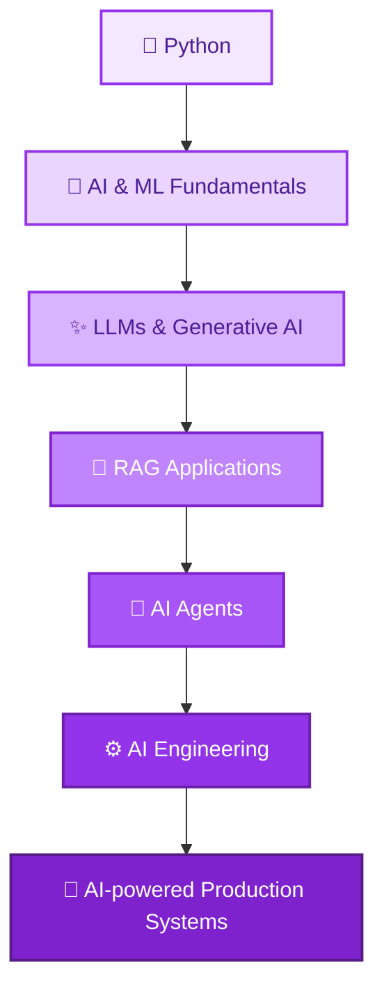
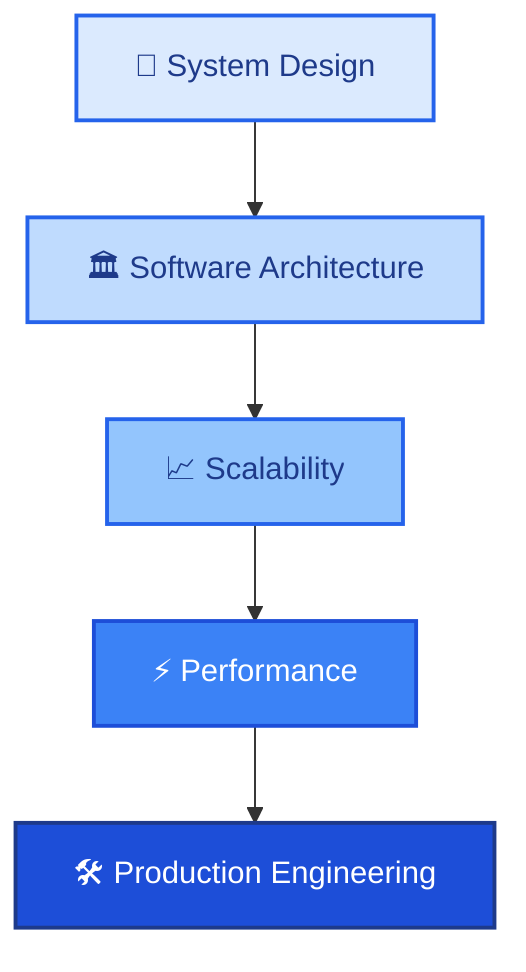

<!-- ==================== HEADER ==================== -->

### Lead Technical Trainer | Java & React | Full-Stack Engineering | AI Engineering | Software Architecture

 

I am a **Lead Technical Trainer** with **8+ years of experience** in technical training, mentoring, and engineering capability development, with strong expertise in **Java, Spring Boot, React,** and **full-stack development**.

My focus is on helping engineers move from foundational knowledge to **deployable and production-ready engineering skills**.

I am currently expanding my expertise into **Python, Generative AI, LLM applications, RAG, AI agents,** and **AI engineering**, while strengthening my capabilities in **software architecture, system design,** and **scalable application development**.

## 🚀 What I Do

<table>
<tr>
<td width="50%" valign="top">

👨‍🏫 &nbsp;Design and deliver **technical training programs** for engineers

☕ &nbsp;Train and mentor engineers in **Java and Spring Boot**

⚛️ &nbsp;Train and mentor engineers in **React and full-stack development**

🏗️ &nbsp;Teach **software engineering principles**, design patterns, and architecture

</td>
<td width="50%" valign="top">

🧑‍💻 &nbsp;Build **production-oriented full-stack applications**

🤖 &nbsp;Explore and build **Generative AI** and LLM-powered applications

📚 &nbsp;Create learning paths, assessments, coding exercises, and **technical labs**

🎯 &nbsp;Help engineers progress from **beginner toward production readiness**

</td>
</tr>
</table>

## 💻 Technical Expertise

 

<h3>☕ &nbsp;Backend</h3>

<h3>⚛️ &nbsp;Frontend</h3>

<h3>🏗️ &nbsp;Software Engineering</h3>

<h3>⚙️ &nbsp;DevOps & Engineering Practices</h3>

<h3>🤖 &nbsp;AI Engineering — <i>Currently Building</i></h3>

## 🏗️ What You'll Find Here

This GitHub profile is being built as a **practical engineering portfolio** containing:

<table>
<tr>
<td width="50%" valign="top">

☕ &nbsp;Java engineering labs

🚀 &nbsp;Production-ready Spring Boot applications

⚛️ &nbsp;Enterprise React applications

🔗 &nbsp;Full-stack Java + React projects

</td>
<td width="50%" valign="top">

🏗️ &nbsp;System design and architecture case studies

🤖 &nbsp;Generative AI and LLM applications

📚 &nbsp;Technical training resources and hands-on labs

🧪 &nbsp;Testing, performance, and engineering experiments

</td>
</tr>
</table>

> 💡 &nbsp;Every major project is intended to demonstrate not only **what was built**, but also **why it was designed that way**.

## 📌 Featured Projects

*Projects are being actively developed and will be added here as they become portfolio-ready.*

 

| | Project | Focus |
|:---:|:---|:---|
| 🚀 | **AI Training Assistant** |    |
| ☕ | **Java Engineering Lab** |    |
| 🔗 | **Full-Stack Platform** |    |
| 🏗️ | **System Design Case Studies** |   |
| 🤖 | **AI Assessment Platform** |    |

## 📚 Training & Mentoring

I have a strong interest in **technical enablement** and **engineering capability development**.

My training approach focuses on:

> I believe effective technical training should go beyond explaining concepts and should help engineers understand **how those concepts are applied in real-world software systems**.

## 🌱 Currently Learning & Building

<table>
<tr>
<td width="50%" valign="top">

**I'm currently deepening my knowledge in:**

</td>
<td width="50%" valign="top">

**At the same time, I am strengthening:**

</td>
</tr>
</table>

## 🎯 Career Focus

I am interested in opportunities across:

## 📊 Engineering Philosophy

### *"Learn deeply. Build practically. Explain clearly. Engineer for production."*

 

I enjoy combining **engineering, architecture, mentoring,** and **continuous learning** to build solutions and help other engineers grow.

## 🤝 Let's Connect

 

I'm always interested in connecting with **engineers, technical leaders, trainers,** and people working on **Java, React, AI, software architecture,** and **engineering enablement**.

 

⭐ &nbsp;If you find any of my projects useful, feel free to explore the repositories and share your feedback.

<!--
**abhishek-jha-tech/abhishek-jha-tech** is a ✨ _special_ ✨ repository because its `README.md` (this file) appears on your GitHub profile.

Here are some ideas to get you started:

- 🔭 I’m currently working on ...
- 🌱 I’m currently learning ...
- 👯 I’m looking to collaborate on ...
- 🤔 I’m looking for help with ...
- 💬 Ask me about ...
- 📫 How to reach me: ...
- 😄 Pronouns: ...
- ⚡ Fun fact: ...
-->
